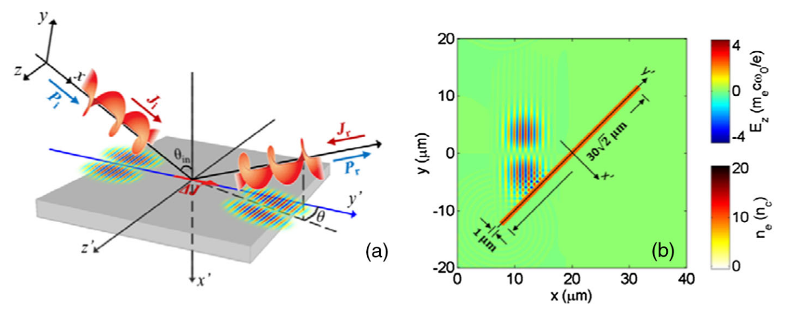
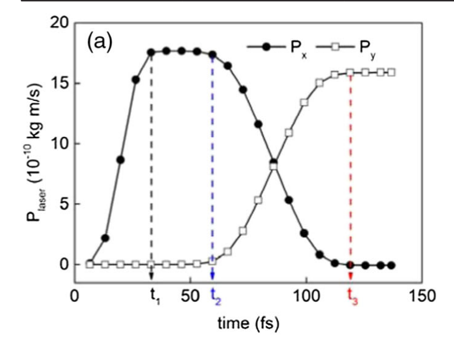
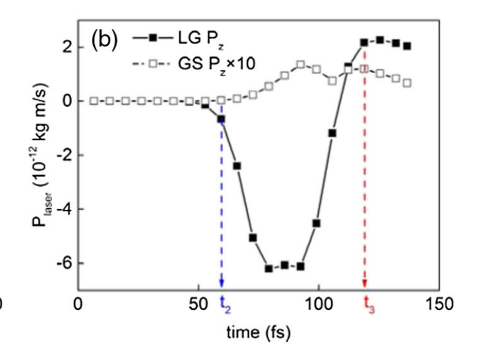
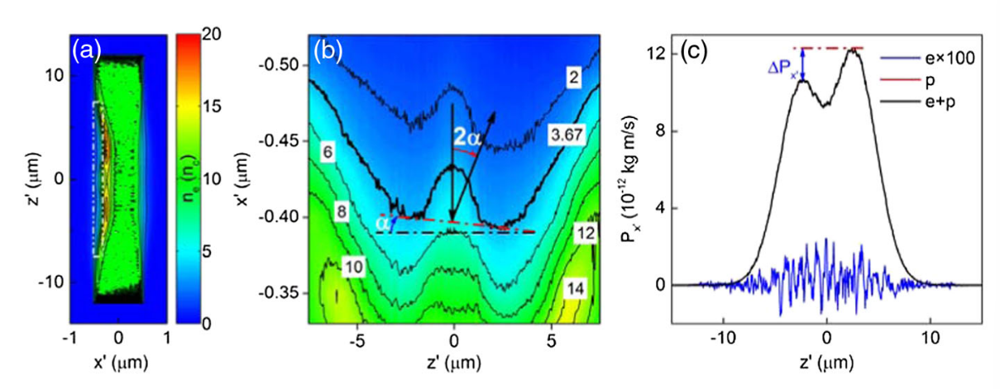

# Deflection of a Reflected Intense Vortex Laser Beam
##  Introduction
- GH AND IF effect(about 反射偏移)
- 原来都是在弱光下，现在有了强光技术（产生相对论性OAM光），因而在强光下探索
## Main Body
当强涡旋LG激光束斜入射到过密等离子体靶上并被反射时，靶面的旋转对称性被破坏

> FIG. 1. (a) Schematic diagram of the proposed mechanism. A LG laser beam (with linear momentum Pi and nonzero AM Ji) is obliquely incident at an angle θin and reflected (with Pr and Jr) by an overdense foil. As a pseudovector, the AM of the beam being parallel with the linear momentum becomes antiparallel after being reflected (this case) and vice versa. The foil obtains AM ΔJ 1⁄4 Ji − Jr according to the AM conservation law. The reflected beam propagates out of the geometrical-optics reflecting x-y plane with a deflection angle θ. (b) Configuration of the PIC simulation box. The distribution of the incident electric field Ez and the electron density  ne of the foil are superposed on the window. The field is normalized to meω0c=e (3.21 × 1012 V=m for λ 1⁄4 1.0 μm), and the electron  density is normalized to nc, where nc 1⁄4 meω20=4πe2 is the critical density.

## 理论分析

- Normal incidence: 不会改变光的角动量方向，箔片没有角动量->不会有反射偏移
- oblique incidence：$$\Delta\mathbf{J}=\mathbf{J}_i-\mathbf{J}_r$$

## 计算模拟

### PIC 方法简介

PIC 模拟是一种将粒子动力学和电磁场演化耦合在一起的数值模拟方法，适用于激光-等离子体相互作用。
PIC 的基本步骤如下：

1. 在网格中放置粒子（这里是电子和质子），每个粒子代表许多真实粒子。
2. 计算电磁场在网格上的分布（解 Maxwell 方程）。
3. 使用电磁场计算每个粒子的受力（洛伦兹力 F = q(E + v × B)）。
4. 更新粒子的位置和速度（牛顿运动方程）。
5. 粒子的位置和速度又影响网格上的电荷密度和电流，反过来影响电磁场。
6. 重复迭代。

### 模拟参数设置

#### 激光参数：

- 模式：LG₀¹ 左旋圆偏振（带轨道角动量 l = 1）
- 波长：λ = 1 μm
- 束腰半径：w₀ = 4.8 μm
- 脉宽：τ = 20 fs，sin² 时间包络
- 峰值电场：E₀ ≈ 1.14 × 10¹³ V/m
- 入射角：θ = π/4，从 +x 方向入射

#### 模拟区域：

- 三维立方体，边长 40 μm
- 被划分为 800 × 800 × 800 的网格单元
- 每个单元有 15 个电子和 15 个质子（模拟等离子体）

#### 目标（箔片）设置：

- 位置：(20, 0, 0) μm
- 密度：10n_c（n_c 是临界密度）
- 尺寸：30√2 μm × 30 μm × 1 μm（沿 y', z', x'方向）

#### 模拟结果及分析

动量：$$\mathbf{P}=\int_V\varepsilon_0(\mathbf{E}\times\mathbf{B})dV$$

$$P_x:$$

- t = 0：激光开始进入模拟区域 → Px 增加
- t ≈ 33 fs：激光完全进入模拟区域 → Px 达到峰值（~1.76×10⁻⁹ kg·m/s）当光束在自由空间中传播时。
- t ≈ 60 fs-120fs：激光与箔片发生作用 → Px 开始下降，Py上升到$$1.59 \times 10^{-9} \, \text{kg m/s}$$
- t ≈ 120fs：$$Pz =  2.15 × 10^{−12} kgm/S$$
- 横向动量（Py, Pz）由于对称性整体积分后约为 0，但局部上存在反对称结构（和 OAM 有关）

1. 分析对象：电子密度分布

- 在激光与箔片完成相互作用时（t = t₃），研究了电子密度的空间分布；
- 具体是在 x₀-z₀ 平面上看密度（对 y₀ 方向积分，即“俯视”观察）；
- 图 3(a) 显示整个分布，图 3(b) 是放大的细节图。

---
2. 发现的现象

- 箔片中心（x₀ ≈ 0）基本没被扰动，密度仍是初始的 10nc；
- **前表面的电子被推开**，产生了两个“凹陷”（密度下降区域）；
  - 这是由于激光的**压强力（ponderomotive force）**推动电子；
  - LG 光束的强度是“甜甜圈形状”的，所以中心没有力，外围最大；
- **两个凹陷不对称**：
  - z₀ > 0 的那一侧凹得更深；
  - 说明激光对箔片的推动产生了**非对称变形** → 箔片表面倾斜。

---

### 3. 倾斜面导致光束偏转
- 激光相当于是被一个“歪斜”的镜子反射；
- 所以反射方向偏向 z₀ > 0 方向；
- 反射角度 = 2α（因为镜面倾斜 α，反射角是两倍）；
- 计算出 α ≈ 1.56 mrad，因此偏转角约为 2 × 1.56 = 3.12 mrad。

---
#### 4. 物理解释

- 使用了圆偏振光，是为了避免“热电子”使靶面不稳定；
- 激光强度足够高，会触发“相对论透明效应”；
  - 这时反射面不在 10nc，而在更高的密度：ne ≈ γnc；
  - γ 是相对论因子，这里 γ ≈ √(1 + a₀²)，算出来反射密度 ≈ 3.67nc；
- 图 3(b) 中画出了这个等密度面，并估算了其斜率 α。

---

#### 5. 最终结果：反射光偏转角

- α 从激光作用开始（t = t₂）到完全反射（t = t₃）逐渐变大；
- 最终取时间平均角度：⟨2α⟩ ≈ 1.63 mrad，这是反射光束的偏转角。

### 参数影响分析
#### 1. 偏转角（θ）与脉宽（τ）的关系
他们用不同脉冲持续时间 τ的激光进行了多组模拟：

结论：在一定范围内，偏转角 θ 随脉宽 τ 近似线性增长。这对于实验设计很关键——如果你想让反射偏转更大，就用更长脉宽的激光。

---
🧲 偏转来源：动量不对称
2. 为什么反射光会偏转？
- 关键是电子箔片上存在沿 z₀ 方向的动量 Px₀ 分布不对称；
- 模拟中对整个靶面沿 x₀ 和 y₀ 积分，得到了总的 Px₀ 分布，见 Fig. 3(c)；
- Px₀ 是双峰的（bimodal），而且 z₀ > 0 的一侧动量更强 → 说明推力在这一边更大 → 造成更深的“凹陷”；
- 这和前面电子密度图中 z₀ > 0 那侧的凹陷更深是对应的。

---
3. 动量值解读
- 背景总动量：P₀ = 1.14 × 10⁻¹¹ kg·m/s；
- 差异 ΔPx₀ = 1.69 × 10⁻¹² kg·m/s ≈ 0.15 × P₀ → 非对称量占到了总量的15%；
- 所以虽然是小比例的不对称，但对反射方向有明显影响。

---
4.动力学角度阐明--麦克斯韦张量
- 总光学力 $$F_t = \oint_a \vec{T} \cdot da - \varepsilon_0 \mu_0 \frac{d}{dt} \int_V S \cdot dV$$
- 其中$$F_x$$中的$$T_{xx}$$提供了横向对称的背景力和动量, 而$$T_{xy}$$项在$$z=0$$两侧方向不同，峰谷插值约为$$1.24\times10^{14}N/m$$,因此$$F_x
$$在z方向不对称。$$F_x$$和$$F_y$$沿x'的方向将电子向前推动，在z’方向上引起电子表面不同深度的变化。
- 从应力张量的角度说，如果在正入射的情况下，剪切分量不起作用。因此仅在斜入射的情况下存在偏转。